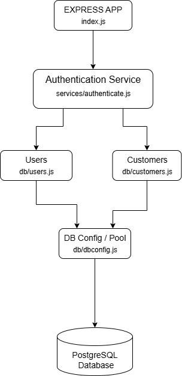

# nodecustomersdb
A secure RESTful API built with Node.js and Express for performing CRUD operations on customer data, featuring JWT authentication and PostgreSQL integration.

## System Overview
This project is a secure RESTful API for managing customer data. It uses Express for routing, PostgreSQL for persistent storage, and JWT for authentication. The API exposes endpoints for CRUD operations on customers, protected by authentication middleware. Automated tests ensure endpoint reliability.

## API Endpoints
Note: Note: All endpoints (except `/login`) require a valid JWT to be provided in the `Authorization` header.

| Route                | HTTP Method | Description              |
|----------------------|-------------|--------------------------|
| `/login`             | POST        | User login (returns JWT) |
| `/api/customers`     | GET         | Fetch all customers      |
| `/api/customers/:id` | GET         | Fetch customer by ID     |
| `/api/customers`     | POST        | Add a new customer       |
| `/api/customers/:id` | DELETE      | Delete a customer by ID  |
| `/api/customers/:id` | PUT         | Update a customer by ID  |

### Error Handling
- **401 Unauthorized:** Returned if the JWT is missing or invalid.
- **400 Bad Request:** Returned for invalid input data, such as incorrect email or password during login.
- **404 Not Found:** Returned if the requested resource (e.g., customer with the specified ID) does not exist.

## What each file does
### index.js
This file loads environment variables, requires all necessary modules, initializes the Express app, enables JSON parsing for incoming requests, sets the local port, defines all API routes (including authentication and customer CRUD operations), starts the server, and exports the app for testing or external use.

### db/customers.js
This file defines and exports handler functions for all the different API routes related to customer data. Each function interacts with the PostgreSQL database to perform CRUD operations.

For example: getAllCustomers is defined as a constant and assigned an arrow function that takes req (request) and res (response) as parameters. Inside, it calls db.query (a wrapper from the pg library), with an SQL query string and a callback function, which receives err and result. If there is no error, it sends back all customers rows from the database as a JSON response using res.json(result.rows). If there is an error, it logs it to the console (basic error handling, needs to be extended for production use).
All other handler functions operate with a similar structure with differences based on the database query.
These handlers are intented to be used as Express route callbacks.

### db/dbconfig.js
This file requires the PostgreSQL library (pg), loads environment variables, and creates a connection pool for efficient database access. It exports a query wrapper function that delegates SQL queries to the pool, allowing other modules to interact with the database easily. For a more detailed explanation read the file comments.

### db/users.js
Provides database handler functions for the users table, similar to how customers.js does for the customers table. Its functions are used for user login and authentication processes.

### services/authenticate.js
This file requires the authentication (jsonwebtoken) and hashing (bcrypt) libraries, as well as the user database handler. It defines the login and authenticate functions for handling user login and token-based authentication, and exports them for use in index.js to secure API routes. For more details read the doc comments in file.

### test/customer.js
This file sets up automated tests for the API endpoints using Mocha as the test runner, along with the Chai and Chai-HTTP libraries for assertions and HTTP requests. It imports the Express app, defines a test customer, and includes tests for the POST and GET /api/customers endpoints. The tests verify response status codes and the structure of the returned data. The tests interact with the actual database (so running them will add test data).